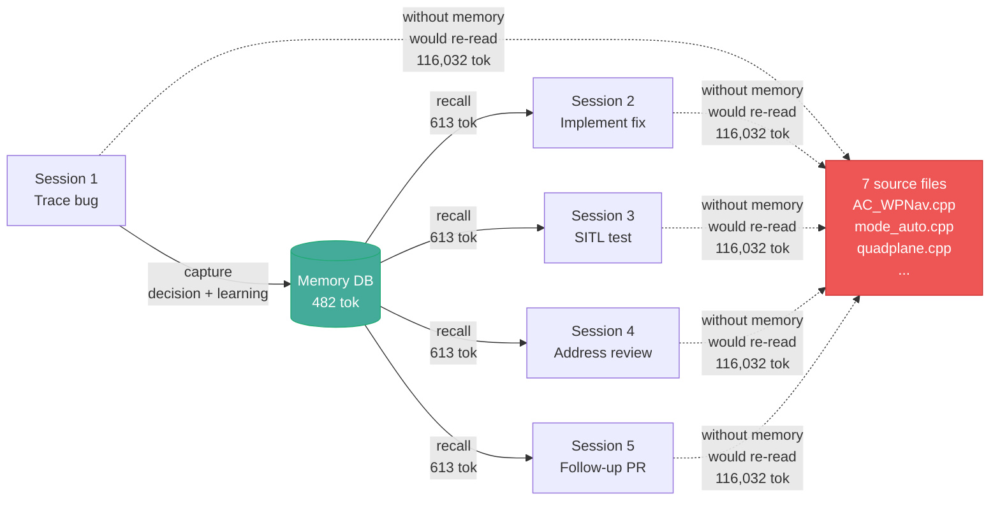
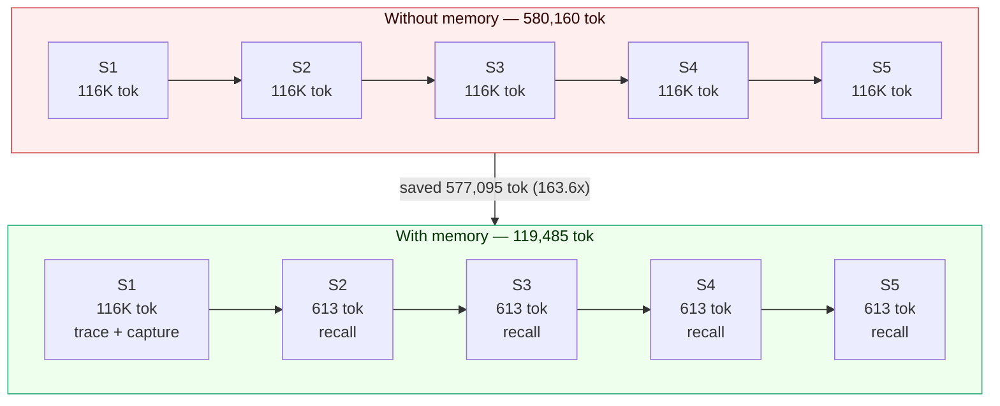

# tdai-memory-mcp

> Local-first MCP memory server for AI coding agents. No API key. No daemon. No external database.

Inherits the L0-L3 layering, RRF fusion, and pluggable storage factory from [TencentDB Agent Memory](https://github.com/TencentCloud/TencentDB-Agent-Memory) (MIT, Tencent 2026). Replaces the cloud backend with embedded SQLite + sqlite-vec + FTS5. Runs as one stdio process on your machine.

## Features

- **14 MCP tools** — `recall`, `capture`, `search`, `forget`, `resolve`, `handoff`, `adr`, `knowledge_create/get/list/delete`, `skill_get/list/search`
- **Hybrid search** — BM25 (FTS5) + vector (sqlite-vec) fused via Reciprocal Rank Fusion in one SQL query
- **L0-L3 layering** — L0 raw captures (always), L1 atoms, L2 scenarios, L3 persona (LLM-optional)
- **Local embeddings** — ONNX model, no API call, no network
- **Multi-tenant** — `team_id`, `agent_id`, `user_id`, `task_id` isolation in every tool
- **Secret redaction** — auto-redacts OpenAI, Anthropic, GitHub, Slack, AWS keys, private keys, high-entropy strings
- **Audit log** — every tool call logged with hashed args, no raw secrets
- **Handoff** — structured context packet between agent sessions, saves 60-85% tokens vs re-reading files
- **Team-shared memory** — commit `.tdai-memory/memory-export.jsonl` to share memory via git. Uses append-only JSONL so parallel branches auto-merge without conflicts
- **Lifecycle hooks** — `SessionStart` auto-injects recent memory into agent context. `SessionEnd` silently captures session summary to memory DB by reading the transcript. No Stop hook, no agent involvement — capture runs automatically on session exit. Writes activity to `~/.local/share/tdai-memory-mcp/session.log`. Supports Claude Code (`~/.claude/settings.json`) and Devin CLI (`~/.config/devin/config.json`).
- **Token savings tracker** — `npx tdai-memory-mcp token-stats` prints a report of estimated tokens saved by memory recall and capture preservation.
- **Trust states** — every capture has a `trust_state`: `candidate` (default), `verified`, `stale`, or `rejected`. Search results rank `verified` above `candidate` above `stale`. Rejected captures are excluded from search and recall.
- **Rejected-value tombstone** — when you reject a capture with a reason, the content hash is tombstoned. Re-capturing the same content is blocked unless `override_rejection: true` is set.
- **Conflict detection** — `capture` checks for similar existing captures in the same session via vector similarity. If conflicts are found, the response lists them. Call `resolve` to mark a winner and supersede the loser.
- **226 tests** — unit + integration + E2E with real MCP server + 16 negative evaluation tests for correction mechanisms

## Install

### 1. Install the package

```bash
npm install -g tdai-memory-mcp
```

Or run without install:

```bash
npx tdai-memory-mcp
```

### 2. Add the MCP server to your agent

Claude Code (`~/.claude.json`):

```json
{
  "mcpServers": {
    "tdai-memory": {
      "command": "npx",
      "args": ["-y", "tdai-memory-mcp"]
    }
  }
}
```

Cursor (`~/.cursor/mcp.json`), Codex CLI, Trae — same JSON block.

Devin CLI:

```bash
devin mcp add tdai-memory --scope user -- npx -y tdai-memory-mcp
```

First run creates the database at `~/.local/share/tdai-memory-mcp/memory.db`. Schema is created automatically.

### 3. Install the skill + lifecycle hooks

This is the key step. Without it, the agent has memory tools but will not use them automatically.

```bash
npx tdai-memory-mcp install-skill && npx tdai-memory-mcp install-hooks
```

What this does:

| Component | What | Where |
|---|---|---|
| **Skill** | Teaches the agent when to recall, capture, and hand off | `~/.claude/skills/`, `~/.agents/skills/`, `~/.config/devin/skills/` |
| **SessionStart hook** | Auto-injects recent memory into agent context on every new session | `~/.claude/settings.json`, `~/.config/devin/config.json` |
| **SessionEnd hook** | Silently captures session summary to memory DB by reading the transcript — no agent involvement, runs on session exit | same config files |

Without hooks: agent has tools but must be told to use them. With hooks: every session starts with relevant memory and ends with an auto-capture.

Restart your agent after install.

## Tools

| Tool | Does | When |
|---|---|---|
| `recall` | Hybrid BM25 + vector search of past memory | Before answering, when user references past work |
| `capture` | Save a decision, learning, task, error, or conversation. Set `verified: true` for confirmed facts. Set `supersedes: <old_id>` to mark an old capture as stale. Set `override_rejection: true` to re-capture previously rejected content. | After a non-trivial task |
| `search` | Filtered search by type, tags, team, user, task, date | When `recall` is too broad |
| `forget` | Delete memory entries (requires `confirm: true`). Set `reject: true` with a `reason` to tombstone the content hash and block re-capture. | Only when user asks |
| `resolve` | Mark one capture as superseding another. The loser is set to `stale` and linked via `superseded_by`. | When `capture` reports a conflict, or to correct an outdated capture |
| `handoff` | Write a structured context packet for the next session | End of session, or before switching agents |
| `adr` | Record an Architecture Decision Record | Architectural decisions future agents need |
| `knowledge_create` | Register a wiki or code-graph asset | Register external knowledge source |
| `knowledge_get` | Retrieve one knowledge asset by ID | Get specific asset details |
| `knowledge_list` | List knowledge assets for a team | See all team assets |
| `knowledge_delete` | Delete knowledge assets by ID | Remove obsolete assets |
| `skill_get` | Retrieve one skill with full content | Get specific skill content |
| `skill_list` | List skills bound to a team | See all team skills |
| `skill_search` | Search skills by keyword | Find a skill by topic |

## How it works

```
L0 Conversation  → raw captured text (always, SQLite + FTS5 + sqlite-vec)
L1 Atom          → atomic facts (LLM extraction, optional, via CLI `extract`)
L2 Scenario      → grouped scene blocks (LLM, optional)
L3 Persona       → user profile (LLM, optional, one per team/agent/user)
```

`recall` reads top-down (L3 → L0). `capture` writes bottom-up (always L0, upper layers when a pipeline runs). Every upper-layer entry links back to its source.

## Correction and trust states

Every capture has a `trust_state` that controls how it appears in search and recall:

| State | Meaning | How it gets set | Search ranking |
|---|---|---|---|
| `candidate` | Default state for new captures | `capture` without `verified` | Baseline score |
| `verified` | Confirmed as correct | `capture` with `verified: true` | 1.5x score boost |
| `stale` | Outdated, superseded by a newer capture | `resolve` tool, or `capture` with `supersedes` | 0.5x score penalty |
| `rejected` | Wrong content, tombstoned | `forget` with `reject: true, reason: "..."` | Excluded from search |

### Rejected-value tombstone

When you reject a capture, the content hash is stored as a tombstone. If the agent tries to capture the same content again, the capture is blocked:

```
Agent: capture { content: "WP_LOITER_RAD = 30m" }
→ Captured: 01ABC...

User: That is wrong. It should be 60m.
Agent: forget { id: "01ABC...", confirm: true, reject: true, reason: "Wrong: should be 60m" }
→ Rejected: 1 captures

Later, agent tries to capture the same wrong value:
Agent: capture { content: "WP_LOITER_RAD = 30m" }
→ Blocked: This content was previously rejected (01ABC...). Reason: Wrong: should be 60m. Set override_rejection to true to force capture.
```

### Conflict detection

When `capture` stores new content, it runs a vector similarity check against existing captures in the same session. If a similar capture is found (cosine distance below 0.15), the response lists the conflict:

```
Agent: capture { content: "WP_LOITER_RAD = 45m for loiter" }
→ Captured: 01DEF...
   Conflicts detected:
     - 01GHI... (similarity: 0.92, state: verified): WP_LOITER_RAD = 60m is the firmware default
   Call resolve to mark one as superseding the other.

Agent: resolve { winner: "01GHI...", loser: "01DEF...", reason: "60m is the firmware default" }
→ Resolved: 01DEF... is now stale (superseded by 01GHI...). Reason: 60m is the firmware default
```

### Schema migration

The trust-state columns (`trust_state`, `rejection_reason`, `superseded_by`) are added by an automatic schema migration (v4 → v5) on first run. Existing databases are backed up before migration. All existing captures default to `candidate` trust state.

## Optional: LLM features

Default mode is `noop` — stores L0 captures and runs hybrid search. Set an LLM API key to unlock L1 atom extraction, L2 scenarios, L3 persona:

```json
{
  "mcpServers": {
    "tdai-memory": {
      "command": "npx",
      "args": ["-y", "tdai-memory-mcp"],
      "env": {
        "TDAI_LLM_API_KEY": "sk-...",
        "TDAI_LLM_BASE_URL": "https://api.openai.com/v1",
        "TDAI_LLM_MODEL": "gpt-4o-mini",
        "TDAI_PIPELINE": "atom"
      }
    }
  }
}
```

## CLI commands

```bash
npx tdai-memory-mcp                    # Start MCP server (stdio)
npx tdai-memory-mcp install-skill      # Install agent skill
npx tdai-memory-mcp install-hooks      # Install lifecycle hooks
npx tdai-memory-mcp uninstall-hooks    # Remove hooks
npx tdai-memory-mcp stats              # Memory statistics
npx tdai-memory-mcp token-stats        # Token savings report
npx tdai-memory-mcp viewer             # Web viewer at http://localhost:7331
npx tdai-memory-mcp export [file]      # Export captures to JSON
npx tdai-memory-mcp import <file>      # Import captures from JSON
npx tdai-memory-mcp backup [dir]       # Backup DB and audit log
npx tdai-memory-mcp sync-export        # Export memory to .tdai-memory/ in project root
npx tdai-memory-mcp sync-import        # Import memory from .tdai-memory/ (auto on startup)
npx tdai-memory-mcp extract            # Run L1 atom extraction (requires TDAI_LLM_API_KEY)
npx tdai-memory-mcp atoms              # List or search L1 atoms
npx tdai-memory-mcp scenarios          # List L2 scenarios
npx tdai-memory-mcp persona            # Read or write L3 persona
npx tdai-memory-mcp knowledge          # List knowledge assets for a team
npx tdai-memory-mcp skills             # List skills for a team
```

## Showcase: Token savings

All numbers below are **measured** with `gpt-tokenizer` (cl100k_base, same as tiktoken). No estimates, no guessed cost models.

### How memory works across sessions



### Real example: ArduPilot PR #33953

[PR #33953](https://github.com/ArduPilot/ardupilot/pull/33953) — *Plane: re-init wp_nav on AUTO mode entry to pick up WP_SPD changes*

**Bug:** On QuadPlane, `Q_WP_SPD` param changes had no effect until reboot. The fix: call `wp_nav->wp_and_spline_init_m()` on AUTO mode entry (matching ArduCopter).

To trace this bug, the agent read 7 ArduPilot source files:

| File | Tokens (measured) |
|---|---|
| `AC_WPNav.cpp` | 11,464 |
| `AC_WPNav.h` | 5,273 |
| `ArduCopter/mode_auto.cpp` | 19,695 |
| `ArduPlane/mode_auto.cpp` | 1,591 |
| `quadplane.cpp` | 48,904 |
| `quadplane.h` | 5,346 |
| `Parameters.cpp` | 23,759 |
| **Total per re-read** | **116,032** |

Session 1 captured the root cause as 2 entries (decision + learning):

| Capture | Type | Tokens (measured) |
|---|---|---|
| `Decision: Loiter circle radius (NAV_LOITER_UNLIM cmd 17) must use WP_LOITER_RAD...` | decision | 199 |
| `Bug fix mission 353: loiter circle radius mismatch...` | learning | 283 |
| **Total stored** | | **482** |

Over 5 sessions, SessionStart injected this memory (613 tok per recall). Without memory, each session would re-read the 7 source files.



| | Without memory | With memory |
|---|---|---|
| Per session | 116,032 tok (re-read 7 files) | 613 tok (recall injection) |
| 5 sessions | 580,160 tok | 3,065 tok |
| **Net saved** | | **577,095 tok** |
| **ROI** | | **163.6x** (1 tok stored → 163.6 tok saved) |
| **Cost saved** | | **$1.73** (at $0.003/1K tokens) |

Run `npx tdai-memory-mcp token-stats` to see live numbers from your own DB and session log.

## Configuration

All settings have defaults. Config file is optional. Path: `~/.config/tdai-memory-mcp/config.json`.

| Setting | Env var | Default | Description |
|---|---|---|---|
| Storage | `TDAI_STORAGE` | `sqlite` | Storage backend |
| Pipeline | `TDAI_PIPELINE` | `noop` | `noop`, `atom`, `scenario`, or `mermaid` |
| DB path | `TDAI_DB_PATH` | `~/.local/share/tdai-memory-mcp/memory.db` | SQLite file |
| LLM key | `TDAI_LLM_API_KEY` | _(unset)_ | LLM API key for pipeline features |
| LLM URL | `TDAI_LLM_BASE_URL` | `https://api.openai.com/v1` | LLM endpoint |
| LLM model | `TDAI_LLM_MODEL` | `gpt-4o-mini` | LLM model name |
| Redact secrets | `TDAI_REDACT_SECRETS` | `true` | Redact secrets on capture |
| Recall tokens | `TDAI_MAX_TOKENS_RECALL` | `4000` | Token cap per recall |
| Search tokens | `TDAI_MAX_TOKENS_SEARCH` | `8000` | Token cap per search |
| Audit log | `TDAI_AUDIT_LOG` | `true` | Write audit log to `audit.jsonl` |
| Hook log | `TDAI_HOOK_LOG_PATH` | `~/.local/share/tdai-memory-mcp/session.log` | Hook activity log |

## TypeScript SDK

```ts
import { Memory } from "tdai-memory-mcp";

const memory = new Memory();
await memory.capture("We chose SQLite for storage.", "decision", ["arch"]);
const results = await memory.recall("storage decision");
```

## Security

- **Secret redaction** on every `capture` call. Patterns for OpenAI, Anthropic, GitHub, Slack, AWS, private keys, plus a high-entropy detector.
- **Read quotas** — `recall` capped at 4000 tokens, `search` at 8000 tokens.
- **Audit log** at `~/.local/share/tdai-memory-mcp/audit.jsonl`. Records every tool call with hashed args. No raw secrets.

## License

MIT. See [LICENSE](./LICENSE).

## Acknowledgments

Inherits architectural patterns from [TencentDB Agent Memory](https://github.com/TencentCloud/TencentDB-Agent-Memory) (MIT, Tencent 2026):
- L0-L3 memory layering (raw → atoms → scenarios → persona)
- Reciprocal Rank Fusion for hybrid BM25 + vector search
- Pluggable storage factory pattern

This project replaces the cloud TencentDB backend with embedded SQLite + sqlite-vec + FTS5. No Gateway. No API key required for the default mode.
