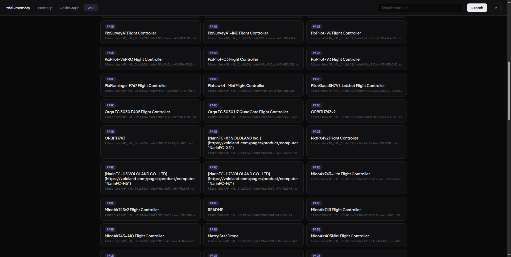
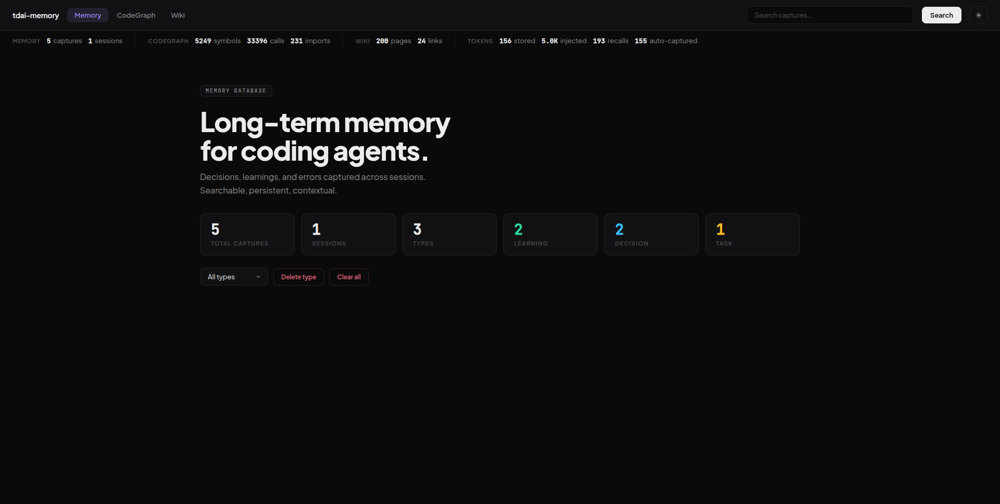
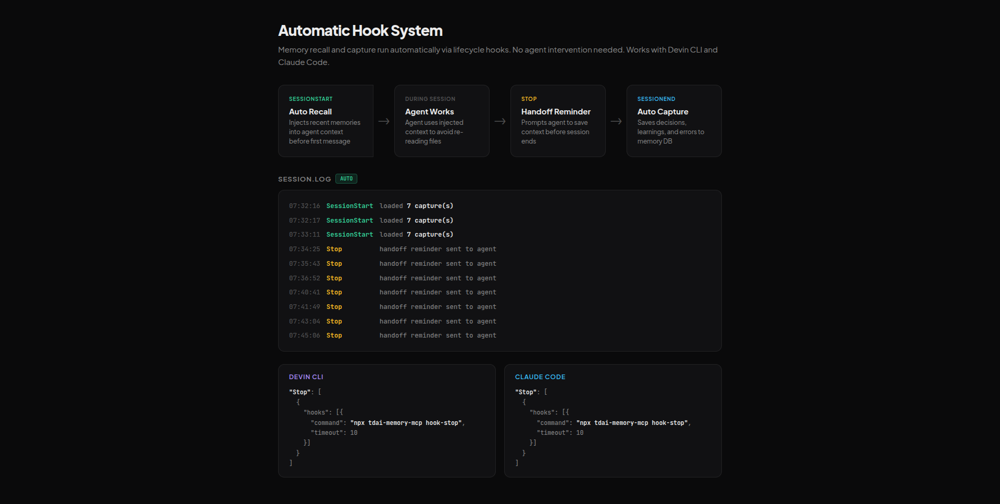

# tdai-memory-mcp

> Local-first MCP memory server for AI coding agents. No API key. No daemon. No external database.

Core based on [TencentDB Agent Memory](https://github.com/TencentCloud/TencentDB-Agent-Memory) (MIT, Tencent 2026). Replaces the cloud backend with embedded SQLite + sqlite-vec + FTS5. Adds CodeGraph, Wiki, and lifecycle hooks.

Memory, CodeGraph, and Wiki in one SQLite file. Lifecycle hooks auto-recall and auto-capture without agent involvement.

## Install

```bash
# 1. Add MCP server to your agent
npx tdai-memory-mcp

# 2. Install skill + hooks + test capture (one command)
npx tdai-memory-mcp setup
```

Claude Code (`~/.claude.json`):

```json
{
  "mcpServers": {
    "tdai-memory": {
      "command": "npx",
      "args": ["-y", "tdai-memory-mcp"]
    }
  }
}
```

Devin CLI:

```bash
devin mcp add tdai-memory --scope user -- npx -y tdai-memory-mcp
```

Restart your agent after `setup`.

## What it does

### Three knowledge layers in one database

Memory, CodeGraph, and Wiki share one SQLite file. A `recall` call returns matching captures, code symbols, and wiki pages in one response.






### Automatic recall and capture via hooks

Lifecycle hooks run memory operations without agent involvement:

- **SessionStart** — injects recent memories into agent context before the first message
- **Stop** — prompts the agent to save a handoff packet before the session ends
- **SessionEnd** — captures the session summary by reading the transcript



The hook log at `~/.local/share/tdai-memory-mcp/session.log` records every event. Works with Devin CLI and Claude Code.

## CLI commands

```bash
# Setup
npx tdai-memory-mcp setup              # Install skill + hooks + test capture
npx tdai-memory-mcp uninstall-hooks    # Remove hooks

# CodeGraph
npx tdai-memory-mcp index --path src --repo .          # Index code (Tree-sitter, 9 languages)
npx tdai-memory-mcp search-code --query <name>         # Search symbols by name
npx tdai-memory-mcp impact <symbol_id>                 # Impact analysis (what breaks if changed)

# Wiki
npx tdai-memory-mcp wiki ingest --path docs --repo .   # Index markdown documentation
npx tdai-memory-mcp wiki search <query>                # Search wiki pages

# Memory
npx tdai-memory-mcp stats              # Memory statistics
npx tdai-memory-mcp viewer             # Web viewer at http://localhost:7331
npx tdai-memory-mcp export [file]      # Export captures to JSON
npx tdai-memory-mcp import <file>      # Import captures from JSON
```

## MCP tools

`recall` `capture` `search` `forget` `resolve` `handoff` `adr` `knowledge_create` `knowledge_get` `knowledge_list` `knowledge_delete` `skill_get` `skill_list` `skill_search` `codegraph_index` `codegraph_search` `codegraph_callers` `codegraph_callees` `codegraph_impact` `codegraph_list` `wiki_ingest` `wiki_search` `wiki_get` `wiki_outdated`

## Configuration

All settings have defaults. Config file is optional. Path: `~/.config/tdai-memory-mcp/config.json`.

| Setting | Env var | Default | Description |
|---|---|---|---|
| DB path | `TDAI_DB_PATH` | `~/.local/share/tdai-memory-mcp/memory.db` | SQLite file |
| LLM key | `TDAI_LLM_API_KEY` | _(unset)_ | LLM API key for pipeline features |
| LLM URL | `TDAI_LLM_BASE_URL` | `https://api.openai.com/v1` | LLM endpoint |
| LLM model | `TDAI_LLM_MODEL` | `gpt-4o-mini` | LLM model name |
| Pipeline | `TDAI_PIPELINE` | `noop` | `noop`, `atom`, `scenario`, or `mermaid` |
| Redact secrets | `TDAI_REDACT_SECRETS` | `true` | Redact secrets on capture |
| Recall tokens | `TDAI_MAX_TOKENS_RECALL` | `4000` | Token cap per recall |
| Search tokens | `TDAI_MAX_TOKENS_SEARCH` | `8000` | Token cap per search |

## TypeScript SDK

```ts
import { Memory } from "tdai-memory-mcp";

const memory = new Memory();
await memory.capture("We chose SQLite for storage.", "decision", ["arch"]);
const results = await memory.recall("storage decision");
```

## Security

- Secret redaction on every `capture` call. Patterns for OpenAI, Anthropic, GitHub, Slack, AWS, private keys, plus a high-entropy detector.
- Read quotas: `recall` capped at 4000 tokens, `search` at 8000 tokens.
- Audit log at `~/.local/share/tdai-memory-mcp/audit.jsonl`.

## License

MIT. See [LICENSE](./LICENSE).
